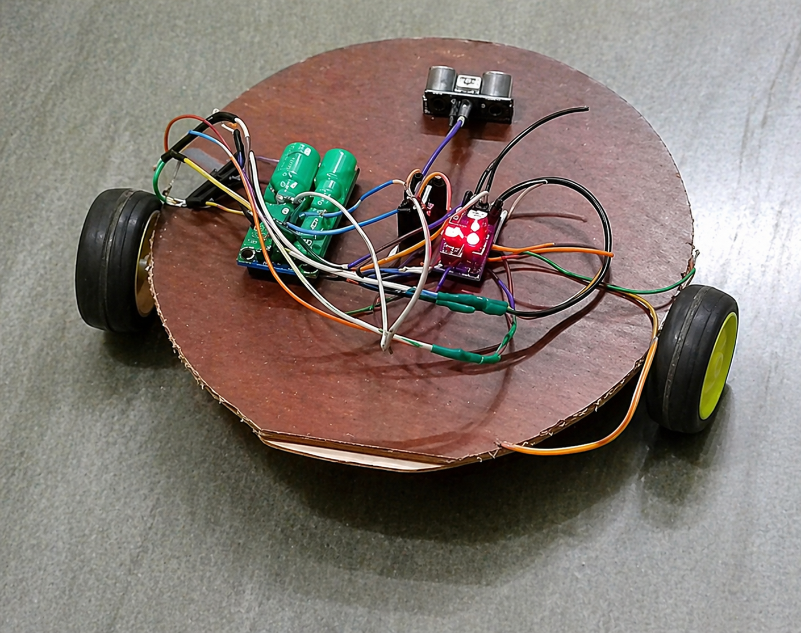

# Autonomous-Robot-for-Floor-Mopping-and-Cleaning
Built an early prototype of autonomous floor mopping robot using a custom circular chassis with differential drive DC motors for smooth navigation. Integrated an ultrasonic sensor and microcontroller-based control system for real-time obstacle detection and path adjustment. 
# 🧼 Autonomous Robot for Floor Mopping

An intelligent, low-cost autonomous robot designed for floor cleaning and mopping using embedded systems, sensor-based navigation, and IoT integration. This project focuses on reducing human effort while improving cleaning efficiency in indoor environments.

---

## 📌 Overview
Cleaning floors is a repetitive and time-consuming task. Existing robotic cleaners are often expensive and mainly limited to vacuum cleaning. This project presents a cost-effective solution that performs **autonomous wet mopping with obstacle avoidance and wireless control**.

The system is built using an ESP32-based platform, integrating sensing, control, and cleaning mechanisms into a single robotic unit.

---

## 🚀 Features
- Autonomous navigation using structured (zig-zag) cleaning pattern  
- Real-time obstacle detection using ultrasonic sensor  
- ESP32-based embedded control system  
- Wireless control and monitoring (IoT support)  
- Integrated mopping mechanism with controlled water usage  
- Low-cost and energy-efficient design  

---

## 🛠️ Hardware Components
- ESP32 Microcontroller  
- ESP32-CAM (for vision-based input)  
- Ultrasonic Sensor (HC-SR04)  
- Motor Driver (L298N)  
- DC Motors with wheels (Differential Drive)  
- Rechargeable Lithium-ion Battery  
- Voltage Regulation Circuit  
- Mop Pad and Cleaning Mechanism  
- Water Pump (optional)  
- Custom Robot Chassis  

---

## ⚙️ System Architecture
The robot consists of the following major modules:
- **Processing Unit:** ESP32 handles control logic, sensor processing, and communication  
- **Sensing Unit:** Ultrasonic sensor + ESP32-CAM for environment perception  
- **Actuation System:** Motor driver controlling DC motors  
- **Cleaning Unit:** Mop pad with optional water dispensing  

---

## 🔄 Working Principle
1. System initializes sensors, motors, and communication modules  
2. Robot starts moving in a **zig-zag cleaning pattern**  
3. Ultrasonic sensor continuously detects obstacles  
4. If obstacle detected:
   - Robot stops  
   - Moves backward  
   - Changes direction  
5. Simultaneously, the **mop pad cleans the floor**  
6. Optional pump dispenses controlled water for wet mopping  
7. Robot continues operation until stopped or battery drains  

This working flow is also illustrated in the system flow diagram in the report 

---

## 🧠 Software & Technologies
- Embedded C/C++ (Arduino IDE)  
- Sensor Interfacing  
- PWM Motor Control  
- Basic AI-based decision logic  
- IoT (Wi-Fi-based control using ESP32)  

---

## 📊 Results
- Successfully navigates indoor environments  
- Efficient obstacle detection and avoidance  
- Effective cleaning on smooth surfaces  
- Reliable wireless control performance  


---

## 📸 Project Preview
```md

